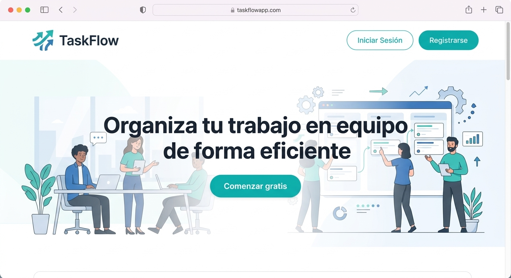
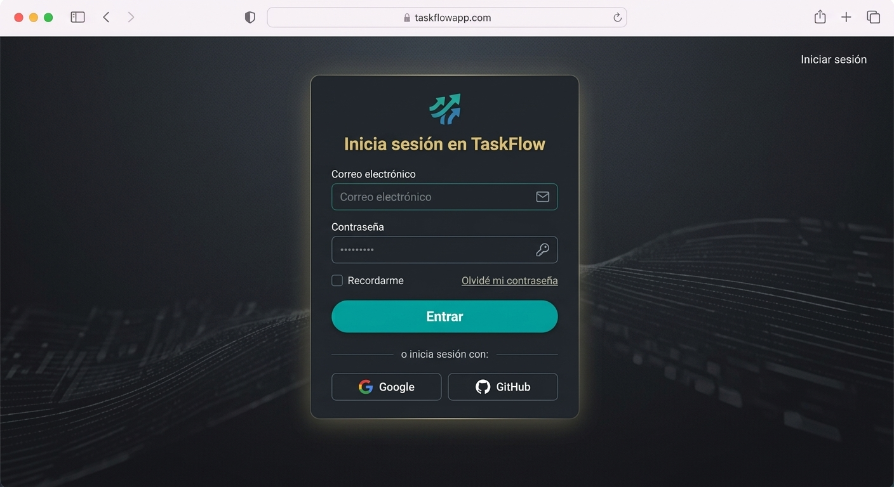
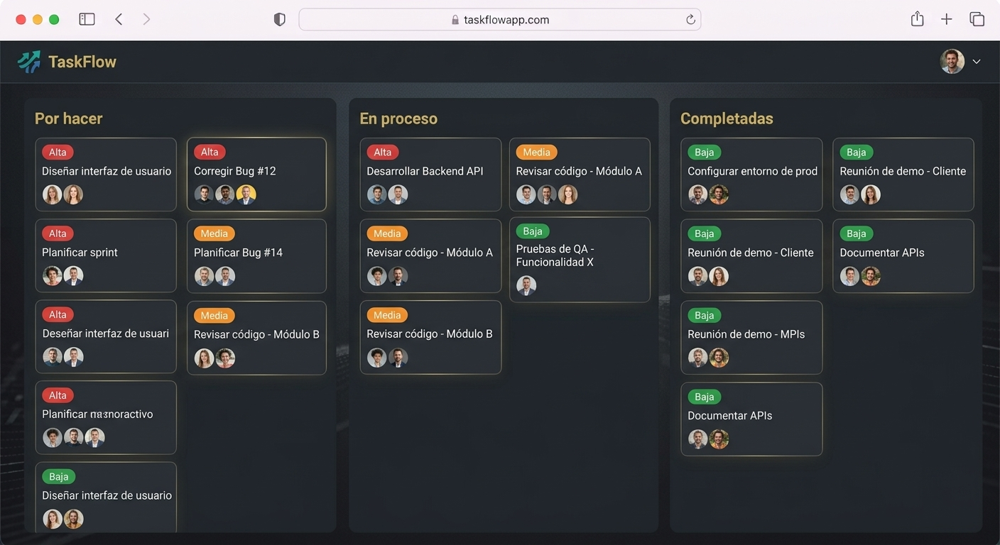
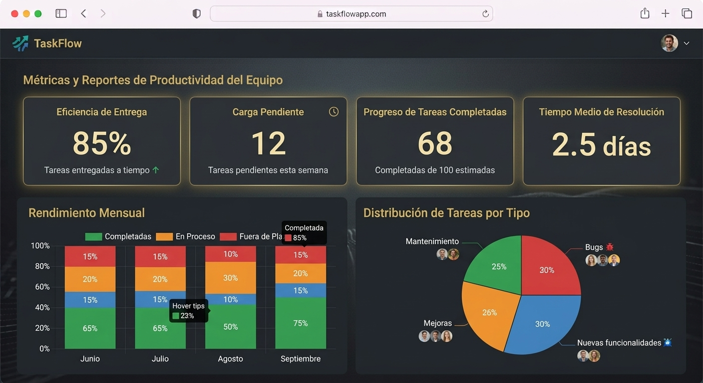

# TaskFlow

## Tabla de contenidos
- [TaskFlow](#taskflow)
  - [Tabla de contenidos](#tabla-de-contenidos)
  - [Descripción](#descripción)
  - [Capturas de pantalla](#capturas-de-pantalla)
    - [Pantalla principal](#pantalla-principal)
    - [Inicio de sesión / Registro](#inicio-de-sesión--registro)
    - [Gestión de tareas (Tablero principal)](#gestión-de-tareas-tablero-principal)
    - [Reportes de avance](#reportes-de-avance)
  - [Funcionalidades principales](#funcionalidades-principales)
  - [Requisitos del sistema](#requisitos-del-sistema)
  - [Checklist de desarrollo](#checklist-de-desarrollo)
  - [Tecnologías utilizadas](#tecnologías-utilizadas)
  - [Instalación y ejecución](#instalación-y-ejecución)

## Descripción
TaskFlow es una aplicación intuitiva diseñada para facilitar la administración, seguimiento y asignación de tareas dentro de proyectos colaborativos.

## Capturas de pantalla
### Pantalla principal

### Inicio de sesión / Registro

### Gestión de tareas (Tablero principal)

### Reportes de avance

## Funcionalidades principales
- Crear, editar y eliminar tareas.
- Asignación de responsables por tarea.
- Clasificación de tareas por prioridad y estado.
- Generación de reportes de avance.

## Requisitos del sistema
- Java Development Kit (JDK) 17 o superior.
- Maven 3.8+
- MySQL Server 8.0+
- Git para control de versiones.

## Checklist de desarrollo
- [x] Registro y autenticación de usuarios
- [x] Creación de tableros de tareas
- [ ] Asignación de colaboradores
- [ ] Notificaciones por correo electrónico
- [ ] Exportación de reportes a PDF

## Tecnologías utilizadas

| Tecnología | Descripción | Versión |
| --- | --- | --- |
| Java | Lenguaje principal | 17 |
| Spring Boot | Framework backend | 3.x |
| MySQL | Base de datos | 8.0 |
| HTML5 / CSS3 | Frontend | - |

## Instalación y ejecución
1. Clonar el repositorio
2. Entrar a la carpeta del proyecto
3. Abrir el proyecto en Visual Studio Code
