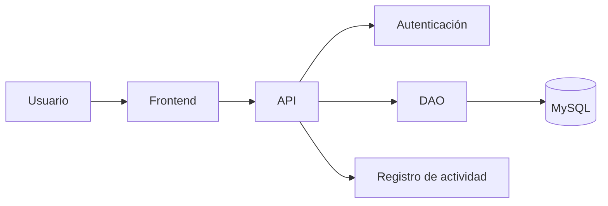

# *TaskFlow*


**TaskFlow** es una aplicación intuitiva diseñada para **facilitar la administración, seguimiento y asignación de tareas** dentro de proyectos colaborativos.

## Tabla de contenidos
- [*TaskFlow*](#taskflow)
  - [Tabla de contenidos](#tabla-de-contenidos)
  - [Descripción](#descripción)
  - [Funcionalidades principales](#funcionalidades-principales)
  - [Tecnologías utilizadas](#tecnologías-utilizadas)
  - [Requisitos del sistema](#requisitos-del-sistema)
  - [Instalación y ejecución](#instalación-y-ejecución)
  - [Uso](#uso)
  - [Capturas de pantalla](#capturas-de-pantalla)
    - [Pantalla principal](#pantalla-principal)
    - [Inicio de sesión / Registro](#inicio-de-sesión--registro)
    - [Gestión de tareas (Tablero principal)](#gestión-de-tareas-tablero-principal)
    - [Reportes de avance](#reportes-de-avance)
  - [Arquitectura](#arquitectura)
  - [Estructura del Proyecto](#estructura-del-proyecto)
  - [Contribuidores](#contribuidores)
  - [Licencia](#licencia)

## Descripción
**TaskFlow** permite organizar la productividad de equipos de trabajo mediante tableros dinámicos, control de usuarios y seguimiento de métricas en tiempo real.

## Funcionalidades principales
- [x] Registro y autenticación de usuarios
- [x] Creación de tableros de tareas (CRUD)
- [ ] Asignación de colaboradores por tarea
- [ ] Notificaciones por correo electrónico
- [ ] Exportación de reportes de avance a PDF

## Tecnologías utilizadas
| Tecnología | Descripción | Versión |
| --- | --- | --- |
| **Java** | Lenguaje principal | 17 |
| **Spring Boot** | Framework backend | 3.x |
|**MySQL** | Base de datos | 8.0 |
| **HTML5 / CSS3** | Frontend | - |

## Requisitos del sistema
- Java Development Kit (JDK) 17 o superior.
- Maven 3.8+
- MySQL Server 8.0+
- Git para control de versiones.

## Instalación y ejecución
1. Clonar el repositorio
```bash
git clone https://github.com/Michi-leon/lab05.git
```
2. Entrar a la carpeta del proyecto
```bash
cd taskflow
```
3. Abrir el proyecto en Visual Studio Code
```bash
code .
```

## Uso
Para ejecutar la aplicación en un entorno local:
1. Iniciar el servidor backend
```bash
mvn spring-boot:run
```
2. Abrir el navegador e ingresar a la URL local: http://localhost:8080

## Capturas de pantalla
### Pantalla principal


### Inicio de sesión / Registro


### Gestión de tareas (Tablero principal)


### Reportes de avance


## Arquitectura
La aplicación está organizada en diferentes componentes que permiten gestionar la interacción con el usuario, la autenticación, el acceso a datos y el registro de actividades.


## Estructura del Proyecto

```text
    taskflow/
    ├── docs/
    │   ├── img/
    │   │   ├── inicio.jpeg
    │   │   ├── login.jpeg
    │   │   ├── tareas.jpeg
    │   │   └── reportes.jpeg
    │   └── GLAB-S05-Markdown aplicado al desarrollo de proyectos colaborativos.docx
    ├── src/
    └── README.md
```

## Contribuidores
Lista de integrantes y desarrolladores del proyecto:
- Desarrollador Principal: Michelle Cameron Leon Leyva / Michi-leon (https://github.com/Michi-leon)

## Licencia
Este proyecto está distribuido bajo la licencia MIT.
Consulta el archivo LICENSE en la raíz del proyecto para más detalles.
